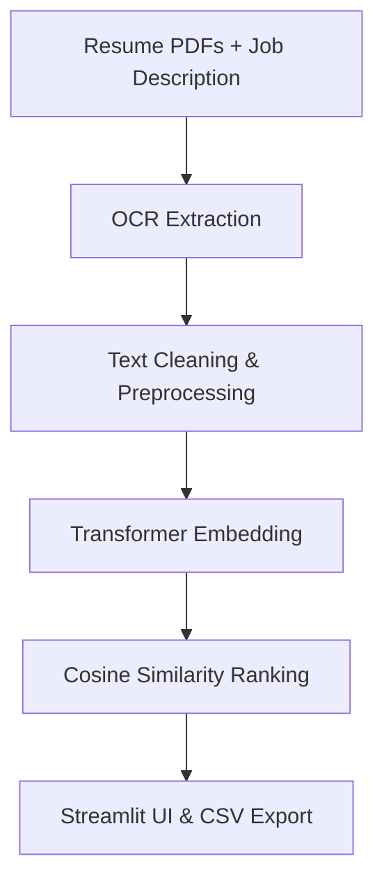

# NLP Transformer-Based Resume Ranker 

**AI-powered automated resume ranking system** using transformers, OCR, and Streamlit — built to showcase full-stack NLP skills and help recruiters find the best fit fast.

---

## What this project does 🔥

- Uses **state-of-the-art transformer embeddings** (`all-mpnet-base-v2`) for semantic matching between resumes and job descriptions.
- Converts resume PDFs → text via **OCR[for images inside pdfs aswell as regular pdfs] (pytesseract + pdf2image)** so no resume format or layout stops the pipeline.
- Cleans and preprocesses raw OCR/PDF-extracted text into clean, normalized, model-ready input.
- Ranks resumes against a job description using **cosine similarity** on embeddings.
- Validated using **Spearman rank correlation** to show AI ranking aligns strongly with human judgment.
- Fully **deployed live with Streamlit** for instant, interactive use—no coding required.
 

---

## Live Demo

Try the app live here:  
[https://rezzraj-nlp-transformer-based-resume-ranker-app-hpudqg.streamlit.app/](https://rezzraj-nlp-transformer-based-resume-ranker-app-hpudqg.streamlit.app/)
---

## Quick Exercise for Recruiters 🚀

1. Navigate to the `sample-resume-repo` below .  
2. Download a few sample resume PDFs  or download whole repository as zip.  
3. Head over to the live Streamlit app:  
   [streamlit app](https://rezzraj-nlp-transformer-based-resume-ranker-app-hpudqg.streamlit.app/)  
4. Upload those resumes in the app.  
5. Paste or type in a job description relevant to your role.  
6. Click **Rank Resumes** and watch the AI pick the best fits!  
7. Download the ranked results as a CSV to save or share.
---


### Download Sample Resumes for Testing

We keep a dedicated repo with all sample resume PDFs here:  
[https://github.com/rezzraj/resume-samples](https://github.com/rezzraj/resume-samples)

1. Click **Code → Download ZIP** to grab all sample resumes.  
2. Extract the zip file on your machine.  
3. Upload the PDFs inside the extracted folder to the Streamlit app here:  
   [streamlit app](https://rezzraj-nlp-transformer-based-resume-ranker-app-hpudqg.streamlit.app/)  
4. Paste your job description, hit **Rank Resumes**, and flex on your hiring process.

---


Try different job descriptions and see how the rankings change — it’s a hands-on way to see how powerful this AI resume ranker really is! 🎯🔥


---

## Pipeline Overview 🛠️




---

## How To Run Locally

```bash
git clone https://github.com/rezzraj/NLP-Transformer-based-RESUME-RANKER.git
cd NLP-Transformer-based-RESUME-RANKER

# Install dependencies
pip install -r requirements.txt

# Run the Streamlit app
streamlit run app.py
```

---

## Repo Structure & File Roles

| Filename                      | Description                                                        |
|-------------------------------|------------------------------------------------------------------|
| `resume_text_extractor.py`     | Extracts text from resume PDFs using OCR; saves to JSON file.    |
| `text_preprocessing.py`       | Cleans and normalizes raw OCR text for transformer input.         |
| `embedding_and_ranking.py`    | Generates embeddings; ranks resumes vs job description; validates with Spearman correlation. |
| `app.py`                      | Streamlit app for live resume ranking; upload resumes + JD and get ranked results. |
| `resume_texts.json`           | Cached raw extracted resume texts from PDFs.                      |
| `cleaned_resumes.json`        | Cached cleaned resume texts ready for embedding.                  |
| `resume_embeddings.npy`       | Precomputed resume embeddings for quick similarity computation.   |
| `job_description.txt`         | Sample job description text used for ranking.                     |
| `job_description_embedding.npy`| Cached job description embedding vector.                        |

---

## Detailed Explanation

### 1. OCR Extraction (`resume_text_extractor.py`)

- Takes a folder of resume PDFs.
- Converts each page of PDFs into images(If cant read the pdf or if the pdf is just image inside it) using `pdf2image`(the streamlit deployed version does not support pdf2image so using PyMuPDF :( still working on it, however you can upload regular actual pdfs.
- Runs OCR via `pytesseract` to extract raw text.
- Saves the extracted text for all resumes into a JSON file (`resume_texts.json`) to avoid repeated OCR.

### 2. Text Cleaning & Preprocessing (`text_preprocessing.py`)

- Loads the raw extracted text.
- Applies text normalization:
  - Lowercasing all letters.
  - Removing newlines, special characters, excessive whitespace.
  - Keeps important characters like `@`, `.`, `/`, `-` for emails, URLs, dates.
- Saves cleaned text to `cleaned_resumes.json`.

### 3. Embedding & Ranking (`embedding_and_ranking.py`)

- Loads cleaned resume texts.
- Uses the SentenceTransformer model `all-mpnet-base-v2` to convert resumes and the job description into embedding vectors.
- Calculates cosine similarity scores between job description and each resume.
- Sorts resumes by similarity to rank best fits first.
- Compares AI ranking with manual human rankings using Spearman correlation to validate performance.

### 4. Streamlit UI (`app.py`)

- Provides an interactive web interface.
- Accepts a job description as text input.
- Allows uploading multiple resume PDFs.
- Runs OCR, cleaning, embedding, and ranking **in real time**.
- Displays ranked results with scores.
- Offers CSV export of rankings.

---

## Results 

- Spearman correlation > 0.9 showing **strong alignment** between AI-generated ranking and human judgment.
- This means the model doesn’t just spit random scores—it matches recruiter intuition well.

---

## Future Roadmap 

- Add **keyword highlighting** in resumes to show why certain resumes scored higher.
- Build **interactive filters/sliders** in the UI to customize ranking criteria.
- Enable **batch processing** for large resume pools and multiple job descriptions.
- Dockerize the entire pipeline for easy deployment anywhere.
- Experiment with **fine-tuning LLMs** for more nuanced semantic matching.
- Integrate **explainability features** for recruiter transparency.

---

## Dependencies

All dependencies are listed in `requirements.txt`. Main ones include:

- `pytesseract`
- `pdf2image`
- `sentence-transformers`
- `scikit-learn`
- `streamlit`
- `pandas`
- `numpy`
- `pillow`


---

## License

This project is licensed under the **MIT License** — rezzraj

---

## About Me

Built by **Akshit Raj** — B.tech 2nd year, and well im fascinated by the transformer architecture.  
Find me on  [LinkedIn](https://www.linkedin.com/in/rezraj/) for collabs, internships, and AI convos. 

---

